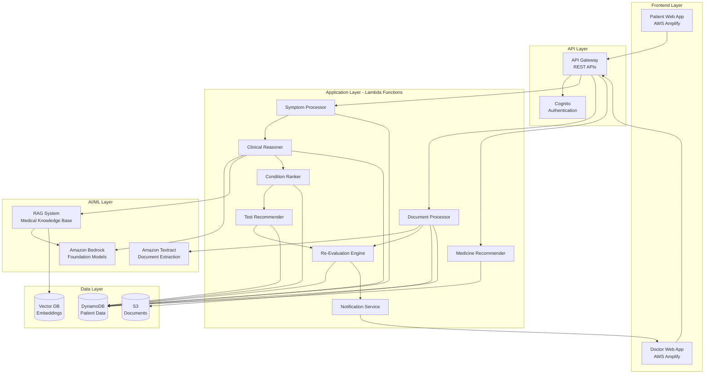

# Design Document: AI-Powered Medical Consultation Platform

## Overview

The AI-Powered Medical Consultation Platform is a healthcare application that leverages AWS Generative AI services to provide intelligent medical consultation support while maintaining strict doctor oversight. The system implements a "doctor-in-the-loop" architecture where AI serves as a decision-support tool rather than an autonomous diagnostic system.

The platform enables patients to input symptoms through text or voice, receive AI-powered preliminary assessments grounded in medical literature, upload blood test results, and receive doctor-reviewed recommendations with affordable medicine suggestions. The system continuously re-evaluates assessments as new data arrives, providing doctors with comprehensive, up-to-date information for clinical decision-making.

### Key Design Principles

1. **AI as Decision Support**: AI augments but never replaces doctor judgment
2. **Explainable AI**: All AI reasoning must be transparent and traceable
3. **Continuous Learning**: System re-evaluates as new data arrives
4. **Security First**: HIPAA-compliant data handling throughout
5. **Scalability**: Serverless architecture for variable patient loads
6. **Cost Optimization**: Generic medicine recommendations and efficient resource usage

## Architecture

### High-Level Architecture



### Architecture Layers

**Frontend Layer**:
- Separate responsive web applications for patients and doctors
- Hosted on AWS Amplify with CI/CD integration
- Real-time updates using WebSocket connections
- Offline capability for symptom logging

**API Layer**:
- Amazon API Gateway managing RESTful endpoints
- AWS Cognito for authentication and authorization
- Role-based access control (Patient, Doctor, Admin)
- Rate limiting and request throttling

**Application Layer**:
- AWS Lambda functions implementing business logic
- Event-driven architecture with asynchronous processing
- Stateless functions for horizontal scalability
- Dead letter queues for failed processing

**AI/ML Layer**:
- Amazon Bedrock for foundation model access (Claude, Llama, etc.)
- RAG system combining vector search with generative AI
- Amazon Textract for blood report data extraction
- Medical knowledge base with embeddings in vector database

**Data Layer**:
- Amazon DynamoDB for patient records and consultation data
- Amazon S3 for document storage with lifecycle policies
- Vector database (OpenSearch or Pinecone) for RAG embeddings
- Encryption at rest and in transit

## Components and Interfaces

### 1. Symptom Processor

**Responsibility**: Process and validate patient symptom input from text or voice.

**Interfaces**:
```typescript
interface SymptomInput {
  patientId: string;
  symptoms: string;
  inputType: 'text' | 'voice';
  timestamp: Date;
  language?: string;
}

interface ProcessedSymptom {
  symptomId: string;
  patientId: string;
  normalizedSymptoms: string[];
  severity: Record<string, number>;
  duration: Record<string, string>;
  timestamp: Date;
}

function processSymptoms(input: SymptomInput): Promise<ProcessedSymptom>;
function validateSymptoms(symptoms: string[]): ValidationResult;
```

**Implementation Details**:
- Voice input transcribed using Amazon Transcribe Medical
- Natural language processing to extract structured symptom data
- Normalization to medical terminology using SNOMED CT codes
- Validation against known symptom vocabulary
- Storage in DynamoDB with patient association

### 2. AI Clinical Reasoner

**Responsibility**: Generate step-by-step diagnostic reasoning using Amazon Bedrock.

**Interfaces**:
```typescript
interface ClinicalReasoningRequest {
  patientId: string;
  symptoms: ProcessedSymptom[];
  patientHistory?: PatientHistory;
  previousReasoningId?: string;
}

interface ReasoningStep {
  stepNumber: number;
  observation: string;
  inference: string;
  confidence: number;
  sources: MedicalSource[];
}

interface ClinicalReasoning {
  reasoningId: string;
  patientId: string;
  steps: ReasoningStep[];
  overallConfidence: number;
  timestamp: Date;
  modelUsed: string;
}

function generateClinicalReasoning(
  request: ClinicalReasoningRequest
): Promise<ClinicalReasoning>;
```

**Implementation Details**:
- Uses Amazon Bedrock with Claude or Llama models
- Implements chain-of-thought prompting for step-by-step reasoning
- Queries RAG system for relevant medical literature at each step
- Generates confidence scores using model logits
- Stores complete reasoning chain for doctor review
- Implements prompt templates for consistent reasoning structure

**Prompt Structure**:
```
You are a medical AI assistant helping doctors with preliminary analysis.
Given the following patient symptoms: {symptoms}
And patient history: {history}

Provide step-by-step clinical reasoning:
1. Identify key symptoms and their significance
2. Consider differential diagnoses
3. Evaluate likelihood of each condition
4. Recommend diagnostic tests

For each step, cite relevant medical literature and provide confidence levels.
Remember: This is preliminary analysis requiring doctor review.
```

### 3. Condition Ranker

**Responsibility**: Rank possible medical conditions by likelihood based on symptoms and reasoning.

**Interfaces**:
```typescript
interface Condition {
  conditionId: string;
  name: string;
  icdCode: string;
  probability: number;
  supportingEvidence: Evidence[];
  contradictingEvidence: Evidence[];
}

interface Evidence {
  type: 'symptom' | 'test_result' | 'patient_history';
  description: string;
  weight: number;
  source: string;
}

interface RankedConditions {
  consultationId: string;
  conditions: Condition[];
  timestamp: Date;
  reasoningId: string;
}

function rankConditions(
  reasoning: ClinicalReasoning,
  symptoms: ProcessedSymptom[]
): Promise<RankedConditions>;
```

**Implementation Details**:
- Combines AI reasoning with probabilistic scoring
- Considers symptom-condition correlations from medical databases
- Incorporates patient history and demographics
- Limits output to 3-10 most likely conditions
- Updates rankings when new data arrives
- Provides evidence for and against each condition

### 4. Test Recommender

**Responsibility**: Suggest appropriate blood tests based on symptoms and possible conditions.

**Interfaces**:
```typescript
interface BloodTest {
  testId: string;
  name: string;
  loincCode: string;
  purpose: string;
  estimatedCost: number;
  urgency: 'routine' | 'urgent' | 'stat';
}

interface TestRecommendation {
  recommendationId: string;
  consultationId: string;
  tests: BloodTest[];
  rationale: string;
  priorityOrder: number[];
  estimatedTotalCost: number;
  doctorApprovalStatus: 'pending' | 'approved' | 'modified' | 'rejected';
}

function recommendTests(
  conditions: RankedConditions
): Promise<TestRecommendation>;
```

**Implementation Details**:
- Maps conditions to relevant diagnostic tests
- Prioritizes by diagnostic value and cost-effectiveness
- Avoids redundant tests
- Provides clear rationale for each recommendation
- Requires doctor approval before sharing with patient
- Considers insurance coverage and patient affordability

### 5. Document Processor

**Responsibility**: Process uploaded blood reports and extract structured data.

**Interfaces**:
```typescript
interface DocumentUpload {
  patientId: string;
  consultationId: string;
  documentType: 'blood_report' | 'imaging' | 'prescription';
  file: Buffer;
  mimeType: string;
}

interface ExtractedTestResult {
  testName: string;
  value: number | string;
  unit: string;
  referenceRange: string;
  abnormalFlag?: 'high' | 'low' | 'critical';
}

interface ProcessedDocument {
  documentId: string;
  s3Key: string;
  extractedData: ExtractedTestResult[];
  extractionConfidence: number;
  requiresManualReview: boolean;
  timestamp: Date;
}

function processDocument(
  upload: DocumentUpload
): Promise<ProcessedDocument>;
```

**Implementation Details**:
- Stores original document in S3 with encryption
- Uses Amazon Textract for text and table extraction
- Applies ML model to identify test names, values, and ranges
- Validates extracted data against expected formats
- Flags low-confidence extractions for manual review
- Normalizes test names to LOINC codes

### 6. Re-Evaluation Engine

**Responsibility**: Continuously update assessments as new data arrives.

**Interfaces**:
```typescript
interface ReEvaluationTrigger {
  consultationId: string;
  triggerType: 'new_symptoms' | 'test_results' | 'daily_update';
  newData: ProcessedSymptom | ProcessedDocument;
}

interface ReEvaluationResult {
  consultationId: string;
  previousReasoning: ClinicalReasoning;
  updatedReasoning: ClinicalReasoning;
  changesExplanation: string;
  significantChange: boolean;
  notifyDoctor: boolean;
  timestamp: Date;
}

function reEvaluateConsultation(
  trigger: ReEvaluationTrigger
): Promise<ReEvaluationResult>;
```

**Implementation Details**:
- Triggered by new symptoms, test results, or daily updates
- Regenerates clinical reasoning with new data
- Compares previous and updated assessments
- Explains what changed and why
- Maintains version history of all assessments
- Notifies assigned doctor of significant changes
- Implements change detection thresholds

### 7. Medicine Recommender

**Responsibility**: Suggest affordable generic medicine alternatives.

**Interfaces**:
```typescript
interface Prescription {
  medicationName: string;
  dosage: string;
  frequency: string;
  duration: string;
  instructions: string;
}

interface GenericAlternative {
  genericName: string;
  brandEquivalent: string;
  costSavings: number;
  availability: PharmacyAvailability[];
  therapeuticEquivalence: string;
}

interface MedicineRecommendation {
  prescriptionId: string;
  originalPrescription: Prescription;
  genericAlternatives: GenericAlternative[];
  pharmacyLinks: string[];
}

function recommendGenericMedicines(
  prescription: Prescription
): Promise<MedicineRecommendation>;
```

**Implementation Details**:
- Maintains database of generic-brand equivalents
- Queries partner pharmacy APIs for pricing and availability
- Prioritizes by cost savings while ensuring therapeutic equivalence
- Provides direct links to online pharmacy ordering
- Includes dosage conversion if needed

### 8. Doctor Review Interface

**Responsibility**: Provide doctors with comprehensive consultation views and approval workflows.

**Interfaces**:
```typescript
interface ConsultationReview {
  consultationId: string;
  patient: PatientSummary;
  symptoms: ProcessedSymptom[];
  clinicalReasoning: ClinicalReasoning;
  rankedConditions: RankedConditions;
  testRecommendations: TestRecommendation;
  testResults?: ProcessedDocument[];
  aiConfidence: number;
}

interface DoctorDecision {
  consultationId: string;
  doctorId: string;
  decision: 'approve' | 'modify' | 'reject';
  modifications?: string;
  prescription?: Prescription;
  notes: string;
  timestamp: Date;
}

function submitDoctorReview(
  decision: DoctorDecision
): Promise<void>;
```

**Implementation Details**:
- Aggregates all consultation data for doctor review
- Displays AI reasoning with confidence indicators
- Allows inline editing of recommendations
- Requires explicit approval before patient notification
- Records doctor identity and timestamp for audit trail
- Supports batch review of multiple consultations

## Data Models

### Patient Record

```typescript
interface Patient {
  patientId: string; // Primary Key
  email: string;
  phoneNumber: string;
  dateOfBirth: Date;
  gender: string;
  medicalHistory: MedicalHistory;
  allergies: string[];
  currentMedications: string[];
  createdAt: Date;
  updatedAt: Date;
}

interface MedicalHistory {
  chronicConditions: string[];
  pastSurgeries: Surgery[];
  familyHistory: string[];
}
```

**DynamoDB Schema**:
- Partition Key: `patientId`
- GSI: `email-index` for login lookup
- Encryption: AWS KMS with customer-managed keys

### Consultation Record

```typescript
interface Consultation {
  consultationId: string; // Primary Key
  patientId: string; // Sort Key
  status: 'active' | 'pending_doctor' | 'completed' | 'cancelled';
  symptoms: ProcessedSymptom[];
  reasoningHistory: ClinicalReasoning[];
  conditionRankings: RankedConditions[];
  testRecommendations: TestRecommendation[];
  testResults: ProcessedDocument[];
  doctorReview?: DoctorDecision;
  prescription?: Prescription;
  createdAt: Date;
  updatedAt: Date;
  completedAt?: Date;
}
```

**DynamoDB Schema**:
- Partition Key: `consultationId`
- Sort Key: `patientId`
- GSI: `patientId-status-index` for patient consultation history
- GSI: `status-createdAt-index` for doctor queue
- TTL: Archive after 7 years per HIPAA requirements

### Symptom Log

```typescript
interface SymptomLog {
  logId: string; // Primary Key
  consultationId: string; // Sort Key
  patientId: string;
  symptoms: string[];
  severity: Record<string, number>;
  notes: string;
  logType: 'initial' | 'daily_update' | 'follow_up';
  timestamp: Date;
}
```

**DynamoDB Schema**:
- Partition Key: `consultationId`
- Sort Key: `timestamp`
- GSI: `patientId-timestamp-index` for patient timeline

### Document Metadata

```typescript
interface DocumentMetadata {
  documentId: string; // Primary Key
  consultationId: string;
  patientId: string;
  s3Bucket: string;
  s3Key: string;
  documentType: string;
  uploadedAt: Date;
  extractedData: ExtractedTestResult[];
  extractionConfidence: number;
  reviewedBy?: string;
  reviewedAt?: Date;
}
```

**DynamoDB Schema**:
- Partition Key: `documentId`
- GSI: `consultationId-uploadedAt-index`
- S3 Lifecycle: Move to Glacier after 1 year

### RAG Knowledge Base

```typescript
interface MedicalKnowledgeEntry {
  entryId: string;
  title: string;
  content: string;
  source: string; // PubMed, UpToDate, etc.
  publicationDate: Date;
  embedding: number[]; // 1536-dimensional vector
  metadata: {
    specialty: string;
    evidenceLevel: string;
    keywords: string[];
  };
}
```

**Vector Database Schema**:
- Stored in Amazon OpenSearch or Pinecone
- Embeddings generated using Amazon Bedrock Titan Embeddings
- Indexed for similarity search
- Updated monthly with new medical literature


## Correctness Properties

*A property is a characteristic or behavior that should hold true across all valid executions of a system—essentially, a formal statement about what the system should do. Properties serve as the bridge between human-readable specifications and machine-verifiable correctness guarantees.*

### Property Reflection

After analyzing all acceptance criteria, I identified several areas of redundancy:

1. **Data Persistence Properties**: Multiple requirements (1.1, 2.3, 6.4, 8.5, 15.1) all test that data is properly stored with timestamps and associations. These can be consolidated into comprehensive persistence properties.

2. **AI Output Structure Properties**: Requirements 2.4, 2.5, 3.1, 3.3, 4.3, 13.1-13.5 all verify that AI outputs contain required fields (confidence scores, explanations, disclaimers). These can be combined into properties about AI output completeness.

3. **Re-evaluation Properties**: Requirements 3.5, 6.1, 6.2 all test that the system updates when new data arrives. These can be consolidated into a single re-evaluation property.

4. **Security Properties**: Requirements 10.1, 10.3, 10.4 all test security measures. These can be combined into comprehensive security properties.

5. **Approval Workflow Properties**: Requirements 4.4, 8.1, 8.4 all test that recommendations require doctor approval. These can be consolidated.

The following properties represent the unique, non-redundant validation requirements:

### Core Functional Properties

**Property 1: Symptom Data Persistence**
*For any* valid symptom input (text or voice), when processed by the Symptom_Analyzer, the system should store the symptom data in the Patient_Database with a timestamp and correct patient association.
**Validates: Requirements 1.1, 1.3**

**Property 2: Invalid Symptom Rejection**
*For any* invalid or incomplete symptom data, the Symptom_Analyzer should return a descriptive error message and not create a consultation record.
**Validates: Requirements 1.4**

**Property 3: AI Reasoning Structure Completeness**
*For any* symptom analysis, the AI_Clinical_Reasoner should generate reasoning that includes: (1) step-by-step observations, (2) confidence scores for each step, (3) citations from the RAG_System, (4) a clear disclaimer that this is preliminary analysis, and (5) storage in the Patient_Database with timestamps.
**Validates: Requirements 2.1, 2.2, 2.3, 2.4, 2.5**

**Property 4: Condition Ranking Bounds**
*For any* symptom analysis, the Condition_Ranker should produce a ranked list containing at least 3 and no more than 10 conditions, each with a probability score and supporting evidence from the RAG_System.
**Validates: Requirements 3.1, 3.3, 3.4**

**Property 5: Patient History Incorporation**
*For any* two patients with identical symptoms but different medical histories, the Condition_Ranker should produce different condition rankings that reflect the different patient histories.
**Validates: Requirements 3.2**

**Property 6: Test Recommendation Completeness**
*For any* set of ranked conditions, the Test_Recommender should suggest blood tests where each recommendation includes: (1) test name and LOINC code, (2) clear rationale, (3) priority ordering, (4) estimated cost, and (5) status marked as "pending doctor approval".
**Validates: Requirements 4.1, 4.2, 4.3, 4.4**

**Property 7: Test Recommendation Uniqueness**
*For any* test recommendation list, no test should appear more than once (no redundant tests).
**Validates: Requirements 4.5**

**Property 8: Document Storage and Encryption**
*For any* uploaded blood report, the system should store the document in S3 with encryption enabled and create a metadata record in DynamoDB linking to the consultation.
**Validates: Requirements 5.1**

**Property 9: Document Data Extraction**
*For any* uploaded blood report in supported formats (PDF, JPEG, PNG), the system should attempt to extract structured test results and assign an extraction confidence score.
**Validates: Requirements 5.2, 5.3**

**Property 10: Re-Evaluation Triggers**
*For any* consultation, when new data is added (symptoms, test results, or daily updates), the Re_Evaluation_Engine should automatically generate updated clinical reasoning and condition rankings.
**Validates: Requirements 3.5, 6.1, 6.2**

**Property 11: Re-Evaluation Change Explanation**
*For any* re-evaluation, the system should produce an explanation of what changed between the previous and updated assessments, and maintain both versions in the history.
**Validates: Requirements 6.3, 6.4**

**Property 12: Significant Change Notification**
*For any* re-evaluation where condition probabilities change by more than 20% or a new high-probability condition appears, the system should notify the assigned doctor.
**Validates: Requirements 6.5**

**Property 13: Daily Reminder Scheduling**
*For any* patient with an active consultation, the system should send a daily reminder to provide symptom updates.
**Validates: Requirements 7.2**

**Property 14: Symptom Progression Tracking**
*For any* series of daily symptom updates, the system should maintain a time-ordered history and generate trend data showing symptom severity changes over time.
**Validates: Requirements 7.3, 7.4**

**Property 15: Doctor Review Routing**
*For any* AI-generated recommendation (condition rankings, test recommendations, or clinical reasoning), the system should route it to an assigned doctor and prevent patient access until doctor approval is recorded.
**Validates: Requirements 8.1, 8.4**

**Property 16: Doctor Review Data Completeness**
*For any* consultation routed to a doctor, the review interface should include all of: symptoms, clinical reasoning, condition rankings, test recommendations, and any uploaded test results.
**Validates: Requirements 8.2**

**Property 17: Doctor Approval Audit Trail**
*For any* doctor approval action, the system should record the doctor's identity, timestamp, decision type (approve/modify/reject), and any modifications made.
**Validates: Requirements 8.5**

**Property 18: Generic Medicine Recommendations**
*For any* doctor-prescribed medication, the Medicine_Recommender should suggest at least one generic alternative (if available) with cost comparison and therapeutic equivalence information.
**Validates: Requirements 9.1, 9.5**

**Property 19: Medicine Recommendation Completeness**
*For any* medicine recommendation, the system should include dosage, frequency, duration, and availability information from partner pharmacies.
**Validates: Requirements 9.2, 9.3**

### Security and Compliance Properties

**Property 20: Data Encryption at Rest**
*For any* patient data stored in DynamoDB or documents stored in S3, encryption should be enabled using AWS KMS.
**Validates: Requirements 10.1**

**Property 21: Role-Based Access Control**
*For any* data access attempt, the system should verify the user's role and only allow access if the role has appropriate permissions for that data type.
**Validates: Requirements 10.3**

**Property 22: Audit Logging**
*For any* data access or modification operation, the system should create an audit log entry containing user identity, timestamp, operation type, and affected resources.
**Validates: Requirements 10.4**

**Property 23: API Request Routing**
*For any* API request to a valid endpoint, the API_Gateway should route it to the correct Lambda function based on the endpoint path and HTTP method.
**Validates: Requirements 11.2**

**Property 24: Rate Limiting Enforcement**
*For any* user making more than 100 requests per minute, the API_Gateway should return a 429 (Too Many Requests) response and not process the excess requests.
**Validates: Requirements 11.3**

**Property 25: Lambda Execution Logging**
*For any* Lambda function execution, the system should log execution start time, end time, duration, and any errors to CloudWatch.
**Validates: Requirements 11.4**

**Property 26: API Authentication**
*For any* request to a protected endpoint, the API_Gateway should reject requests without valid authentication tokens with a 401 (Unauthorized) response.
**Validates: Requirements 11.5**

### AI Transparency Properties

**Property 27: AI Explanation Presence**
*For any* AI-generated recommendation, the output should include a detailed explanation of the reasoning process with specific steps documented.
**Validates: Requirements 13.1**

**Property 28: Medical Literature Citations**
*For any* AI clinical reasoning, the output should cite at least one medical literature source from the RAG_System for each major inference.
**Validates: Requirements 13.2**

**Property 29: Confidence Level Labeling**
*For any* AI output displayed to users, the interface should clearly show confidence levels and uncertainty indicators.
**Validates: Requirements 13.3**

**Property 30: Reasoning Chain Accessibility**
*For any* AI recommendation, doctors should be able to access the complete reasoning chain including all intermediate steps and data sources.
**Validates: Requirements 13.4**

**Property 31: Preliminary Analysis Disclaimer**
*For any* AI-generated output, the system should include a clear label indicating this is preliminary analysis requiring doctor review, never presenting it as a definitive diagnosis.
**Validates: Requirements 13.5**

### Error Handling and Reliability Properties

**Property 32: Error Logging with Context**
*For any* error or exception, the system should create a log entry containing error type, stack trace, user context, and relevant request parameters.
**Validates: Requirements 14.1**

**Property 33: Critical Error Alerting**
*For any* error classified as critical (database unavailable, AI service failure, security breach), the system should send an alert to system administrators within 1 minute.
**Validates: Requirements 14.2**

**Property 34: Retry with Exponential Backoff**
*For any* transient failure (network timeout, rate limit, temporary service unavailability), the system should retry the operation with exponentially increasing delays (1s, 2s, 4s, 8s) up to 5 attempts.
**Validates: Requirements 14.3**

**Property 35: Graceful Degradation**
*For any* service degradation (AI service slow response, database read replica unavailable), the system should continue operating with reduced functionality and display a user-visible notice.
**Validates: Requirements 14.5**

### Data Management Properties

**Property 36: Consultation History Completeness**
*For any* patient, the system should maintain a complete, time-ordered history of all consultations including symptoms, AI reasoning, test recommendations, test results, and prescriptions.
**Validates: Requirements 15.1**

**Property 37: History Export Format**
*For any* patient history export request, the system should generate output in the requested format (PDF or JSON) that includes all consultation data in human-readable form.
**Validates: Requirements 15.2, 15.3**

**Property 38: Data Deletion with Audit Preservation**
*For any* patient data deletion request, the system should delete all personal health information while preserving audit log entries (with anonymized identifiers) for compliance.
**Validates: Requirements 15.5**

## Error Handling

### Error Categories

**1. User Input Errors**
- Invalid symptom data (empty, malformed, non-medical text)
- Unsupported file formats for blood reports
- Missing required fields in API requests
- **Handling**: Return 400 Bad Request with descriptive error message, do not create partial records

**2. Authentication and Authorization Errors**
- Missing or invalid authentication tokens
- Insufficient permissions for requested operation
- Expired sessions
- **Handling**: Return 401 Unauthorized or 403 Forbidden, log security event, do not expose internal details

**3. AI Service Errors**
- Amazon Bedrock rate limiting or throttling
- Model inference timeout
- RAG system query failure
- Low confidence in AI output
- **Handling**: Retry with exponential backoff, fall back to simpler models if available, flag for manual review, notify doctor of AI uncertainty

**4. Data Storage Errors**
- DynamoDB write failures
- S3 upload failures
- Document extraction failures
- **Handling**: Retry transient failures, use dead letter queues for persistent failures, maintain data consistency, alert administrators

**5. External Service Errors**
- Pharmacy API unavailable
- Transcription service failure
- Email/SMS notification failure
- **Handling**: Queue for retry, provide degraded functionality, inform users of delays

**6. System Errors**
- Lambda timeout
- Memory exhaustion
- Unexpected exceptions
- **Handling**: Log with full context, alert administrators, return 500 Internal Server Error, ensure no data corruption

### Error Recovery Strategies

**Idempotency**:
- All API operations should be idempotent using request IDs
- Duplicate symptom submissions should update existing records, not create duplicates
- Re-evaluation should be safe to trigger multiple times

**Compensation**:
- Failed document uploads should clean up partial S3 objects
- Failed consultation creation should roll back all related records
- Failed notifications should be queued for retry

**Circuit Breakers**:
- After 5 consecutive failures to an external service, open circuit for 60 seconds
- Provide cached or degraded responses during circuit open state
- Gradually close circuit with test requests

**Graceful Degradation**:
- If AI services are unavailable, allow symptom logging and doctor manual review
- If RAG system is down, use AI without literature citations (with clear warning)
- If pharmacy API is down, provide generic recommendations without real-time pricing

## Testing Strategy

### Dual Testing Approach

This system requires both unit testing and property-based testing for comprehensive coverage:

**Unit Tests**: Focus on specific examples, edge cases, and integration points
- Specific symptom input examples (chest pain, fever, headache)
- Edge cases (empty inputs, extremely long text, special characters)
- Error conditions (invalid tokens, missing data, service failures)
- Integration between components (API Gateway → Lambda → DynamoDB)

**Property-Based Tests**: Verify universal properties across all inputs
- Generate random symptom descriptions and verify processing
- Generate random patient histories and verify ranking differences
- Generate random consultation states and verify re-evaluation
- Test security properties with random access patterns

### Property-Based Testing Configuration

**Framework**: Use `fast-check` for TypeScript/JavaScript or `Hypothesis` for Python

**Configuration**:
- Minimum 100 iterations per property test
- Seed-based reproducibility for failed tests
- Shrinking enabled to find minimal failing examples
- Timeout of 30 seconds per property test

**Test Tagging**: Each property test must reference its design document property:
```typescript
// Feature: ai-medical-consultation, Property 1: Symptom Data Persistence
test('symptom data persistence property', async () => {
  await fc.assert(
    fc.asyncProperty(
      fc.record({
        patientId: fc.uuid(),
        symptoms: fc.string({ minLength: 10, maxLength: 500 }),
        inputType: fc.constantFrom('text', 'voice'),
      }),
      async (input) => {
        const result = await processSymptoms(input);
        const stored = await getFromDatabase(result.symptomId);
        
        expect(stored).toBeDefined();
        expect(stored.patientId).toBe(input.patientId);
        expect(stored.timestamp).toBeInstanceOf(Date);
      }
    ),
    { numRuns: 100 }
  );
});
```

### Test Coverage Requirements

**Component Tests**:
- Symptom Processor: 90% code coverage
- AI Clinical Reasoner: 85% code coverage (AI calls mocked)
- Condition Ranker: 90% code coverage
- Test Recommender: 90% code coverage
- Document Processor: 85% code coverage (Textract mocked)
- Re-Evaluation Engine: 90% code coverage
- Medicine Recommender: 90% code coverage

**Integration Tests**:
- End-to-end consultation flow (symptom → reasoning → ranking → test recommendation → doctor review)
- Document upload and extraction flow
- Re-evaluation triggered by new data
- Doctor approval workflow
- Medicine recommendation and pharmacy integration

**Security Tests**:
- Authentication and authorization for all endpoints
- Data encryption verification
- Audit logging verification
- Rate limiting enforcement
- RBAC policy enforcement

**Performance Tests**:
- API response time < 500ms for 95th percentile
- AI reasoning generation < 10 seconds
- Document processing < 30 seconds
- Support 1000 concurrent users
- Database query performance < 100ms

### Mocking Strategy

**External Services to Mock**:
- Amazon Bedrock: Mock with predefined reasoning responses
- Amazon Textract: Mock with sample extracted data
- Pharmacy APIs: Mock with sample pricing data
- Email/SMS services: Mock with delivery confirmation

**Real Services in Integration Tests**:
- DynamoDB: Use local DynamoDB for integration tests
- S3: Use LocalStack or MinIO for integration tests
- API Gateway: Use SAM local for integration tests

### Continuous Testing

**Pre-commit**:
- Run unit tests
- Run linting and type checking
- Run security scanning (SAST)

**CI Pipeline**:
- Run all unit tests
- Run property-based tests
- Run integration tests
- Run security tests
- Generate coverage reports
- Deploy to staging environment

**Post-deployment**:
- Run smoke tests against production
- Monitor error rates and latency
- Run synthetic transactions
- Verify audit logging
